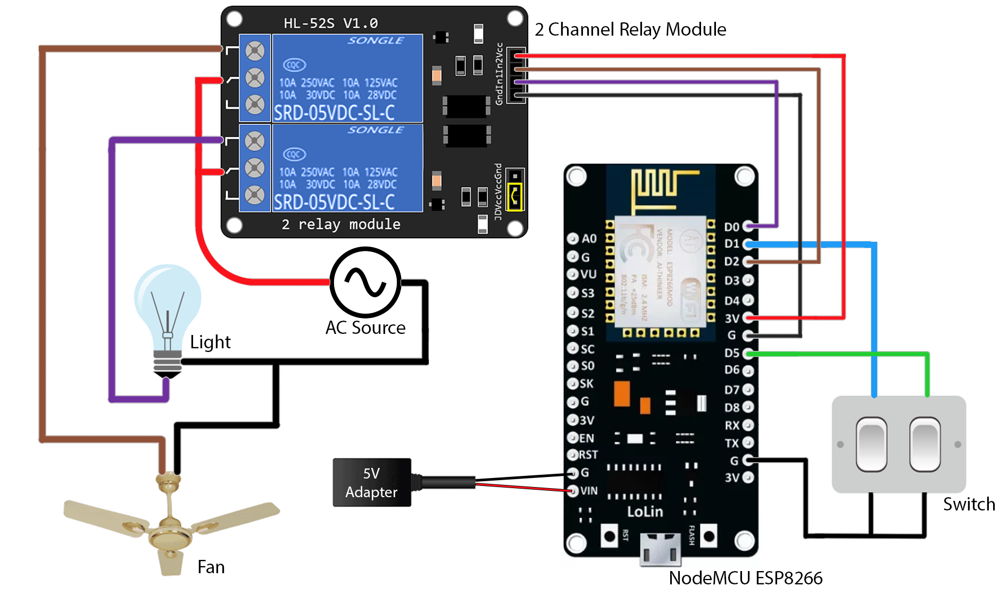

# IoT Home Automation Project with NodeMCU ESP8266 (ESP-12E Module)

Welcome to the official GitHub repository for the IoT Fan and Light Control project. This project harnesses advanced technology, utilizing the NodeMCU ESP8266 (ESP-12E Module) and a relay module to exert precise control over a room's lighting and ceiling fan. The project's control interface is conveniently accessible through a responsive web application (Web App), providing users with seamless management of their environment.

What sets this project apart is its integration with the Blynk cloud platform, which not only stores device state data but also empowers users with remote control capabilities from anywhere in the world. Whether you're at home or halfway around the globe, you can effortlessly manage your fan and light settings through the intuitive Web App.

But the innovation doesn't stop there. In addition to the Web App interface, this project features a cutting-edge integration with Google Assistant through IFTTT. Voice commands become your control tool, allowing you to operate your fan and light simply by speaking to your smart assistant. This fusion of IoT technology and voice control enhances the convenience and accessibility of your living space.

## Features
- Control fan and light remotely through a web interface.
- Seamless integration with Google Assistant for voice control.
- Utilizes the NodeMCU ESP8266 (ESP-12E Module) and relay module for IoT functionality.
- Real-time status updates using Blynk cloud for on/off state.
- Easy-to-understand code for both the ESP8266 and the web interface.
- Web application built with VoltBuilder.
- Video demonstration of the project in action.

## Recover Fan and Light State After Power Interruption

This project includes a power state retention feature that ensures the fan and light settings remain unchanged after a power outage or load shedding event. This feature enhances user convenience by preserving your preferred device state.

**How it works:**

**How it works:**

- **State Preservation**: Before a power cut, the system records the current state of the fan and light and saves it in the EEPROM of the ESP8266.
- **Automatic Restoration**: When power is restored, the system automatically retrieves the saved settings from the EEPROM and restores the devices to their previous state.

This intelligent use of EEPROM storage ensures that your preferred device settings are securely retained, even in the event of a power interruption.

## Project Components
- NodeMCU ESP8266 (ESP-12E Module)
- Relay Module
- Web App for control
- Blynk Cloud integration

## Getting Started
1. **Hardware Setup**: Begin by establishing the hardware configuration. Connect the NodeMCU ESP8266 (ESP-12E Module) to the relay module and the fan/light as shown in the diagram below.
2. **Blynk Cloud Setup**: Proceed to set up your Blynk Cloud account by visiting the official [Blynk](https://www.blynk.io/) website. Create your account, establish your IoT template and project, and then generate your unique Blynk Automation Token.
3. **NodeMCU Code Configuration**: Access the NodeMCU (ESP-12E Module) code, situated within the `/nodemcu_code` directory. Within this code, replace the Blynk Automation Token with your uniquely generated token, and additionally, provide the SSID and Password of your wireless router. Once this code customization is complete, proceed to upload the modified code to your NodeMCU 1.0 (ESP-12E Module) utilizing the Arduino IDE.
4. **Web App**: For the web application component, upload the provided web app code found in the `/web_app_code` directory to VoltBuilder. This process will convert the web interface into a native application. Ensure you provide your Blynk Automation Token within the Blynk API in the JavaScript code during this step.

## Connection Diagram

## Code Structure
- `/nodemcu_code`: Contains the Arduino sketch for the NodeMCU 1.0 (ESP-12E Module).
- `/web_app_code`: Includes the HTML, CSS, and JavaScript files for the web App.

## Web Application (Powered by VoltBuilder)
The web application for controlling the fan and light in this project was built using [VoltBuilder](https://volt.build/). VoltBuilder is a powerful tool for creating cross-platform web applications from your HTML, CSS, and JavaScript code. It allows you to easily package and deploy your web app on various platforms, making it accessible to a wider audience.

## Google Assistant Integration
Enhance the convenience and functionality of your IoT Fan and Light Control project by seamlessly integrating it with Google Assistant. With the power of voice commands, you can control your fan and light effortlessly. Here's how to set it up:
1. **IFTTT Account**: Ensure you have an active account on [IFTTT](https://ifttt.com/) (If This Then That).
2. **Blynk API Key**: Retrieve your Blynk API key from your Blynk cloud account, which is essential for communication with your IoT devices.
3. **Google Assistant Applet**: Create custom applets in IFTTT, connecting Google Assistant to your Blynk-based IoT project. Set up voice triggers and the Blynk API Webhook to control the fan and light.
4. **Voice Control**: Once the integration is complete, simply use voice commands with Google Assistant to activate or deactivate the fan and light, enhancing the accessibility and ease of use of your IoT solution.

This integration opens up exciting possibilities for hands-free control of your environment, making your IoT project even more versatile and user-friendly.

## Video Demonstration
Watch the video below to see the project in action:

## Contributing
If you'd like to contribute to this project or report issues, please open an issue or submit a pull request on the GitHub repository.

## Acknowledgments
I would like to acknowledge the following for their contributions to this project:
- [Blynk](https://www.blynk.io/) - for providing a robust platform for IoT device control and data storage.
- [VoltBuilder](https://volt.build/) - for making the development and deployment of the web application seamless and efficient.
